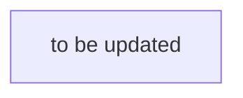
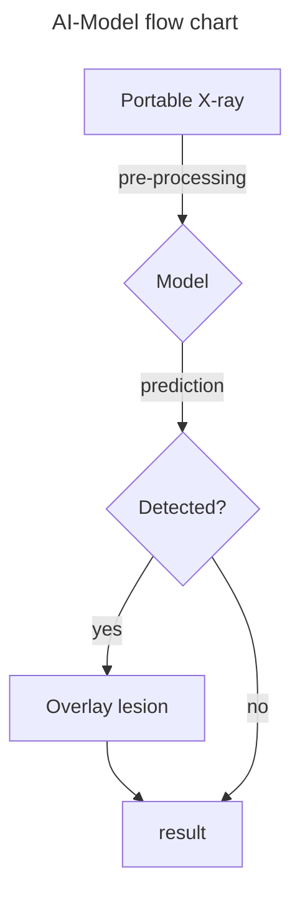

# GOAT_41

<div align="center">

## 📌&nbsp;&nbsp;The overall flowchart of the project.



<br>

---

<br>


</div>

## 1. Usage

### 1.1 how to train? 

```python
python3 train.py tbu
```

### 1.2 how to evaluation?

```python
python3 evaluate.py tbu
```