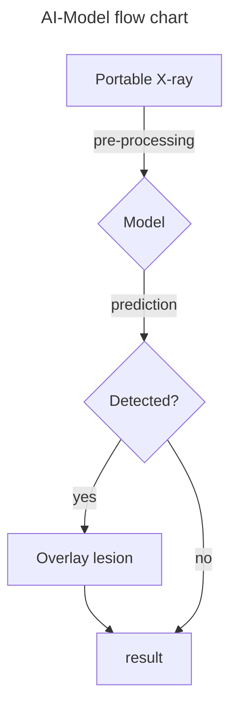

# GOAT_41

```mermaid

---
title: AI-Model flow chart
---
flowchart TD
    A[Portable X-ray] 
    B{Model}
    C{Detected?}
    D[Overlay lesion]
    E[result]
    
    
    A -- " pre-processing " --> B
    B -- " prediction " --> C
    C -- "yes" --> D 
    D --> E
    C -- "no" --> E
    

    
    

```